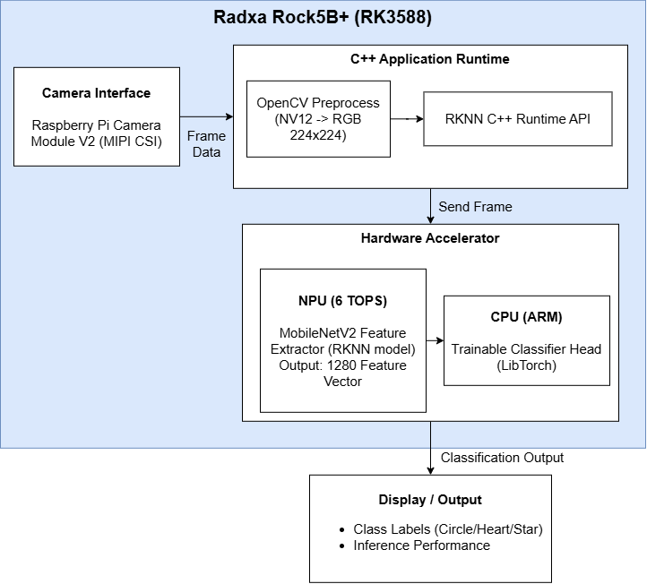
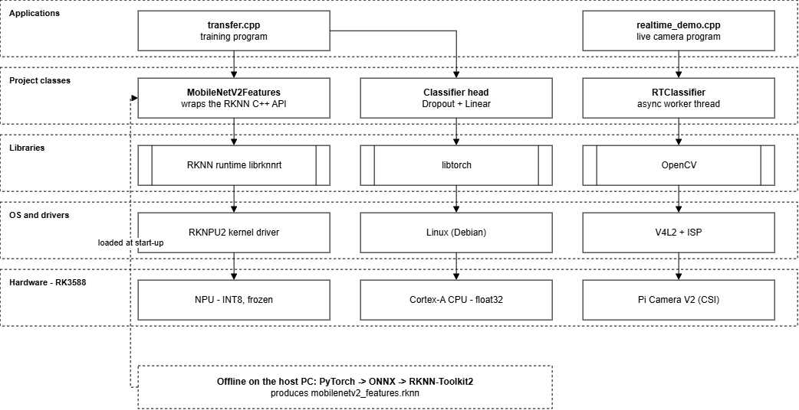
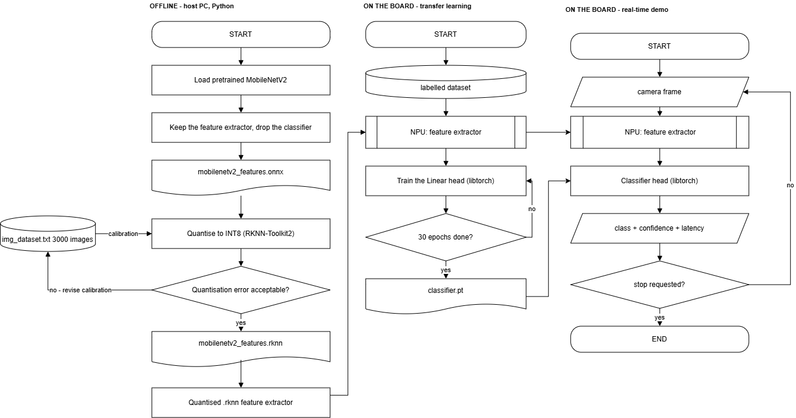
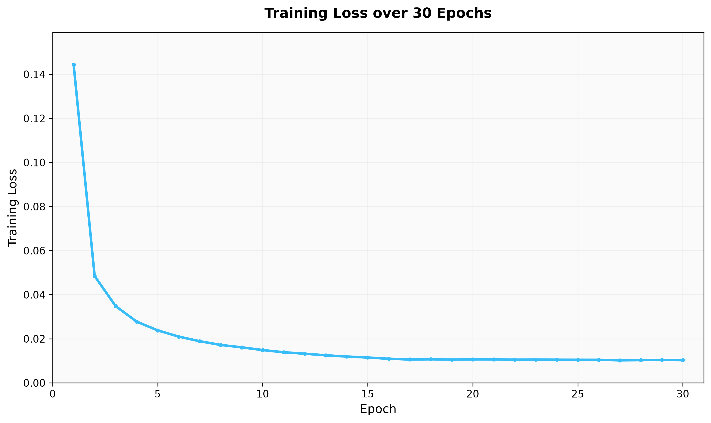

# MobileNetV2 deployment on ROCK 5 NPU for edge computing and transfer learning
## Overview
This project implements real-time image classification on the Radxa Rock5B+ (RK3588) by combining NPU-accelerated feature extraction with CPU-based transfer learning. Data classification using a frozen MobileNetV2 feature extractor running on the RK3588 NPU with a trainable classifier layer. A single linear layer is trained with libtorch on the CPU. The NPU runs INT8 inference via the Rockchip RKNN SDK. The classifier is trained and run with LibTorch (C++) and can be retrained for new classes without recompiling the NPU model.





## Training Workflow
1. **Offline (host PC)** - strip the ImageNet head from a pretrained MobileNetV2, export to ONNX and quantise to INT8 with RKNN-Toolkit2. Output file: `mobilenetv2_features.rknn`.
2. **Transfer learning (on the board)** - `transfer.cpp` runs the NPU feature extractor and trains the Linear head with LibTorch. Output file: `classifier.pt`.
3. **Real-time demo (on the board)** - `realtime_demo.cpp` reads camera frames, runs the NPU extractor, feeds the result to the trained head and prints the class, prediction score and latency.


**NOTE 1:** It is recommended to run all Python scripts from the top level `mobilenet_rock5` directory after cloning this repository. Running the script from other directories may require modifying the file paths in the scripts accordingly. 

**NOTE 2:** The RKNN Toolkit currently supports Python versions up to Python 3.12. Therefore, Python 3.13 or later may not be compatible with the RKNN Toolkit and may cause errors when running the code. It is recommended to use Python 3.12 for this project.

**NOTE 3:** ONNX Runtime version 1.26.0 is used to ensure compatibility with the other package versions in this project.

**NOTE 4:** This project uses the heart, circle and star patterns as the target classes. If you plan to test the project with other datasets or different classes, you may need to manually update the class names in the relevant scripts to match the classes in your dataset (such as `onnx_to_rknn.py`, `onnx_model_test.py`, `rknn_model_test.py`, `rknnlite_model_test.py`, `transfer.cpp` & `realtime_demo.cpp`).

---

## Bill of Materials (BOM)
| Component | Quantity |
|-----------|----------|
| Radxa Rock5B+ 8GB RAM | 1 |
| Radxa Rock5B Case | 1 |
| USB-C PD Power Supply | 1 |
| M2 Memory Card | 1 |
| M2 Memory Card Reader | 1 |
| Raspberry Pi Camera Module V2 | 1 |
| Rock5 Camera FPC Cable (31-pin to 15-pin) | 1 |
| USB WiFi Dongle | 1 |

--- 

## Prerequisites
All commands, setup, and installation steps must be performed directly on the board.

### Build Python3.12 from the source code
Before running the setup script, install the required system packages:

**1. Install require dependencies**
```bash
sudo apt update
sudo apt-get install wget build-essential checkinstall 
sudo apt install -y build-essential libssl-dev zlib1g-dev libbz2-dev libreadline-dev libsqlite3-dev wget curl llvm libncurses5-dev libncursesw5-dev xz-utils tk-dev libffi-dev liblzma-dev python3-openssl git
```

**2. Install required packages**
```bash
wget https://www.python.org/ftp/python/3.12.0/Python-3.12.0.tgz
tar -xf Python-3.12.0.tgz
cd Python-3.12.0
./configure --enable-optimizations
make -j8
```

**3. Install Python**
```bash
make altinstall
```
When Python 3.12 is installed manually from source, it is typically installed to /usr/local/bin/python3.12.
Otherwise, the package installation is located in /usr/bin/.

**NOTE:** Please make sure to update the file path in the Environment Setup section if Python 3.12 is installed in a different location.

**4. Verify installation after download**
```bash
python3 --version
```

### Environment setup
Run this shell script to create the virtual environment:
```bash
./setup_env.sh
```
Activate the environment:
```bash
source rock5b_env/bin/activate
```

Or run this to create manually:
```bash
# Install required packages for C++ build
sudo apt install cmake libtorch-dev libopencv-dev
wget https://github.com/microsoft/onnxruntime/releases/download/v1.26.0/onnxruntime-linux-aarch64-1.26.0.tgz
tar -xzf onnxruntime-linux-aarch64-1.26.0.tgz
mv onnxruntime-linux-aarch64-1.26.0 onnxruntime
```

```bash
/usr/local/bin/python3.12 -m venv rock5b_env
source rock5b_env/bin/activate
python3.12 -m pip --version
python -m pip install --upgrade pip 
```

```bash
# Download RKNN Related Repositories
mkdir rknpu
git clone https://github.com/airockchip/rknn-toolkit2.git --depth 1 rknpu/rknn-toolkit2

# Install RKNN Toolkit Lite2 for Python 3.12
pip install rknpu/rknn-toolkit2/rknn-toolkit-lite2/packages/rknn_toolkit_lite2-2.3.2-cp312-cp312-manylinux_2_17_aarch64.manylinux2014_aarch64.whl
```

```bash
# Install all required Python packages
pip install -r requirements.txt
```

### C++ build to compile the transfer learning code
Please ensure that all required dependencies and environment settings are properly configured before running CMake. Run the setup_env.sh script or setup manually first to setup the required environment.
```bash
cmake .
make
```

### Create the dataset of shapes

Run this command:
```bash
python ./python/get_dataset.py
```
which downloads the `2d-geometric-shapes-17-shapes` dataset from Kaggle which contains stars and circles
but we also want hearts! The heart pattern is then generated by the script and add to the dataset.

### Copy the rknn runtime to the library path
```
sudo cp ./rknpu/rknn-toolkit2/rknpu2/runtime/Linux/librknn_api/aarch64/librknnrt.so /usr/lib64/
```

## Export MobilenetV2 features to ONNX
```bash
python ./python/mobilenetv2_to_onnx.py
```
This script generates an ONNX model file in the models directory, **`models/mobilenetv2_features.onnx`**

---

## Convert ONNX to RKNN (with INT8 quantization)
```bash
python ./python/onnx_to_rknn.py
```
This uses **img_dataset.txt** (list of image paths) as the calibration dataset. It generates a RKNN model file in the models directory, **`models/mobilenetv2_features.rknn`**

## Benchmarking
### CPU and NPU Performances Comparison
Run to benchmark the model performances via different hardware accelerators:
```bash
python ./python/benchmark.py
```
This scripts provides evaluation of the model performance across both CPU and NPU backends to measure inference latency, throughput and accuracy.

### RKAIQ Camera Engine Setup (Optional)
Camera Configuration: This project uses a Raspberry Pi Camera Module v2 connected to the board's CAM0 port.

RKAIQ camera processing is **disabled by default**. To disable the RKAIQ camera engine, set: 
```cpp
const bool rkaiq_cam_eng = true
```
To enable the RKAIQ camera engine, set:
```cpp
const bool rkaiq_cam_eng = false
```
Please check dependencies are compatible before installation. If you plan to use the RKAIQ camera engine, you may need to manually locate and install the appropriate camera engine package for your camera and system configuration. Please ensure that the package and all required dependencies are compatible before installation.

**NOTE:** Check your camera pipeline before running the code. The setup and configuration process may differ depending on the camera model and hardware being used.

### Real-Time Demo
Run the following command with the selected inference backend to perform real-time image classification using a live camera feed:

**NPU Inference**
```bash
./demo npu
```
**CPU Inference**
```bash
./demo cpu
```

---
## Tests
Each script targets a different inference backend. Choose any of the following scripts to verify the model, depending on the runtime you wish to use:
```bash
python ./test/onnx_model_test.py
python ./test/rknn_model_test.py
```
The following table provides an overview of the test scripts:
| Test | Description |
|------|-------------|
| onnx_model_test.py | Batch tests on the ONNX model with the classifier head |
| rknn_model_test.py | Batch tests on the RKNN model via rknn-toolkit2 |

---

## Transfer learning 
Run to learn to train the final classifier:
```bash
./transfer
```
This script generates an classifier file in the models directory, **`models/classifier.pt`** and logs the loss to **`loss.dat`**

The file `loss.dat` contains the loss:


---

## Documentation
### Project Structure 
```text 
mobilenet_rock5/ 
|── data/                       # Dataset used for training and evaluation 
|── model/                      # Trained models and converted RKNN models generated from the script
|── python/                    # Training, conversion, and inference scripts 
│   |── create_dataset.py 
│   |── benchmark.py            # CPU vs NPU latency/accuracy comparison
│   |── mobilenetv2_to_onnx.py  # Export MobileNetV2 feature extractor to ONNX 
│   |── onnx_to_rknn.py         # Convert ONNX model to RKNN format 
|── test/                       # Calibration and model verification scripts 
│   |── onnx_model_test.py 
│   |── rknn_model_test.py 
|── CMakeLists.txt
|── README.md  
|── mobilenetv2_features.h
|── realtime_d.h
|── realtime_demo.cpp           # Real time classification demo
|── realtime_demo_w_monitor.cpp # Real time classification demo with a small monitor
|── requirements.txt            # Python package dependencies 
|── setup_env.sh                # Script to create a virtual environment 
|── transfer.cpp                # Transfer learning
|── LICENSE
``` 
